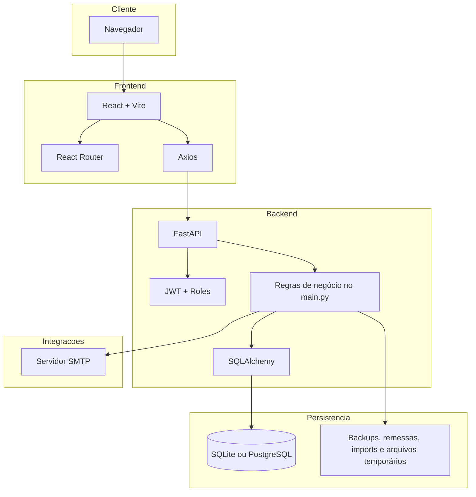
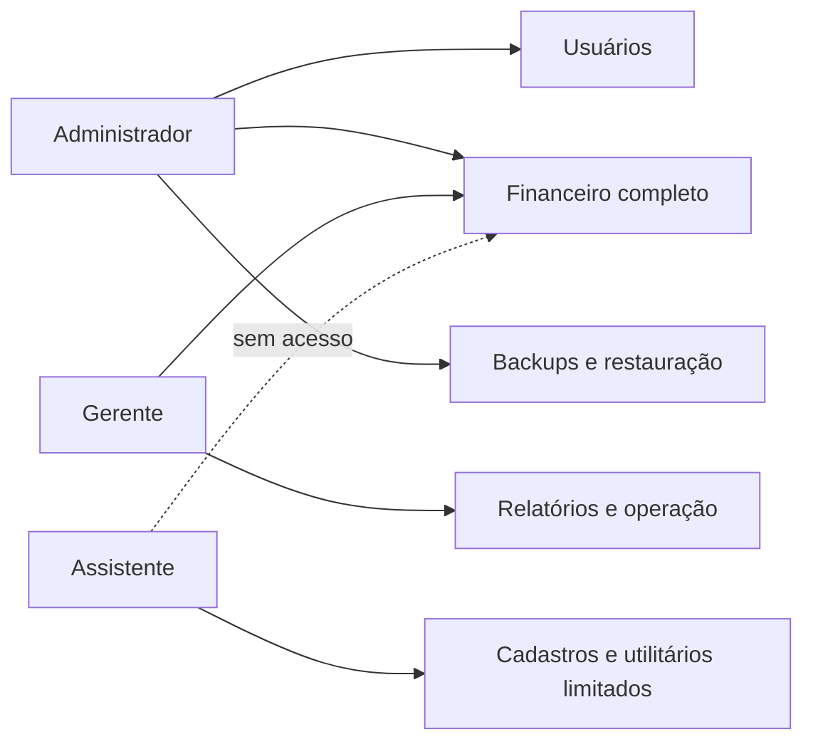

# Arquitetura do Projeto UNACOB

## Visão geral

O sistema é composto por um frontend SPA em React e um backend monolítico em FastAPI. A aplicação foi organizada para atender operação interna da associação, com forte concentração de regras de negócio no backend.



## Camadas principais

### 1. Interface web

Local: `webapp/frontend`

Responsabilidades:

- autenticação e guarda do token no navegador;
- roteamento da aplicação;
- renderização dos módulos de negócio;
- consumo dos endpoints da API;
- tratamento visual de erros e feedbacks.

Pontos centrais:

- `src/App.jsx`: definição das rotas e proteção de acesso.
- `src/components/Sidebar.jsx`: navegação principal por módulo.
- `src/api.js`: configuração do cliente HTTP e interceptação de sessão expirada.

### 2. API e regras de negócio

Local: `webapp/backend`

Responsabilidades:

- autenticação e autorização;
- validação de payloads com Pydantic;
- aplicação das regras do domínio;
- consulta e persistência de dados;
- geração de relatórios, backups e arquivos operacionais.

Observação importante:

Grande parte da lógica está concentrada em `main.py`, que hoje atua como controller e service ao mesmo tempo. Isso facilita a implantação, mas aumenta o acoplamento e o tamanho do arquivo.

### 3. Persistência

Responsabilidades:

- mapear entidades do domínio com SQLAlchemy;
- abrir sessões de banco;
- adaptar execução para SQLite local ou outros bancos via `DATABASE_URL`.

Arquivos centrais:

- `database.py`
- `models.py`
- `schemas.py`

## Principais domínios funcionais

### Segurança e usuários

- login via JWT;
- consulta do usuário autenticado;
- perfis `administrador`, `gerente` e `assistente`.

### Cadastro de associados

- dados pessoais e de contato;
- matrícula, inscrição e atributos de vínculo;
- status do associado;
- dados relacionados à DABB.

### Financeiro

- pagamentos de mensalidade;
- despesas;
- outras receitas;
- plano de contas;
- previsões orçamentárias;
- fluxo de caixa;
- balancete;
- transações consolidadas.

### Conciliação bancária

- importação de extratos;
- sugestões automáticas;
- reconciliação manual;
- lançamento de despesa ou receita a partir do extrato.

### Aplicações financeiras

- registros manuais;
- resumo por período;
- importação de informações a partir de PDF.

### Eventos e festas

- cadastro de festas;
- envio de convites;
- geração de link público;
- confirmação de participação;
- gestão de participantes e pagamentos.

### Utilitários e administração

- aniversariantes;
- etiquetas;
- relatórios;
- backup e restauração;
- verificação do status do SQLite;
- healthcheck.

## Modelo de acesso por perfil



## Estrutura de diretórios comentada

```text
webapp/
  backend/
    main.py                 # endpoints, regras e rotinas administrativas
    auth.py                 # autenticação JWT e usuário atual
    database.py             # engine e sessão SQLAlchemy
    models.py               # entidades do domínio
    schemas.py              # contratos de entrada e saída
    sql/                    # scripts auxiliares e guias de migração
    data/                   # dados locais e backups do backend
  frontend/
    src/
      pages/               # telas por módulo
      components/          # componentes compartilhados
      context/             # autenticação e contexto global
      utils/               # utilitários de apoio
```

## Deploy e execução

Modos identificados no repositório:

- local com Python e Node;
- local ou servidor via Docker Compose;
- hospedagem em Render;
- hospedagem em Railway;
- PaaS compatível com Procfile.

## Riscos técnicos atuais

- `main.py` concentra muitas responsabilidades e tende a dificultar manutenção.
- Não há suíte formal de testes automatizados cobrindo regras críticas.
- Não há ferramenta explícita de migração versionada de banco.
- O repositório ainda mantém artefatos legados e scripts na raiz, o que exige disciplina operacional.

## Recomendações de evolução arquitetural

1. Separar o backend por módulos de domínio.
2. Extrair serviços de conciliação, DABB e relatórios para arquivos dedicados.
3. Introduzir migrações de banco com Alembic ou equivalente.
4. Criar testes de integração para fluxos financeiros e de autenticação.
5. Definir convenção de changelog e releases.