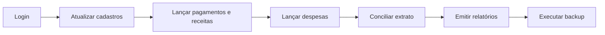
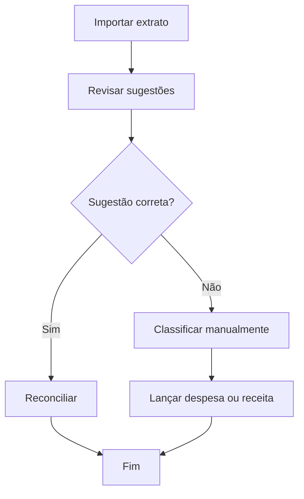
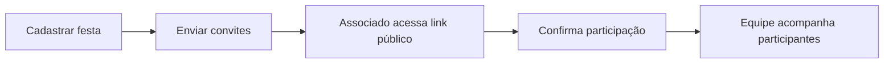

# Manual do Usuário

## 1. Como acessar o sistema

### Acesso local

1. Inicie o backend.
2. Inicie o frontend.
3. Abra a URL exibida pelo Vite no navegador.
4. Faça login com seu e-mail e senha.

### Acesso em produção

1. Abra a URL pública configurada para a aplicação.
2. Informe suas credenciais.
3. Aguarde o carregamento do painel principal.

## 2. Perfis de acesso

### Administrador

- acesso total aos módulos;
- criação e manutenção de usuários;
- backup, restauração e recursos administrativos.

### Gerente

- acesso às rotinas financeiras e operacionais;
- sem foco em administração estrutural do sistema.

### Assistente

- acesso a cadastros e utilitários permitidos;
- sem acesso ao conjunto principal de telas financeiras.

## 3. Tutorial básico de uso

### Fluxo resumido de operação mensal



## 3.1 Atualizar cadastro de associado

1. Abra o menu lateral.
2. Entre em Cadastro de Associados.
3. Pesquise pelo nome, CPF, matrícula ou e-mail.
4. Abra o registro desejado.
5. Atualize os campos necessários.
6. Salve as alterações.

## 3.2 Registrar mensalidade

1. Acesse Receitas de Mensalidades.
2. Selecione o mês de referência.
3. Localize o associado.
4. Informe valor, data e forma de pagamento.
5. Salve o lançamento.

## 3.3 Registrar despesa ou outra receita

1. Abra o módulo correspondente no menu Financeiro.
2. Informe descrição, valor, data e conta contábil.
3. Revise os dados.
4. Salve o registro.

## 3.4 Conciliar extrato bancário

1. Acesse Conciliação.
2. Importe o extrato no formato aceito.
3. Revise as sugestões automáticas.
4. Faça reconciliação manual quando necessário.
5. Lance despesa ou receita a partir do item ainda não classificado.

Fluxo visual:



## 3.5 Cadastrar e gerenciar festa

1. Abra Festas.
2. Cadastre nome, data, local e valores.
3. Salve a festa.
4. Gere ou envie convites.
5. Acompanhe participantes e confirmações.

Fluxo visual:



## 3.6 Emitir relatórios

1. Entre em Relatórios.
2. Escolha o tipo de relatório.
3. Informe filtros do período ou critério desejado.
4. Gere e baixe o arquivo, quando aplicável.

## 4. Instalação para uso local

### Backend

```bash
cd webapp/backend
python -m venv .venv
.venv\Scripts\activate
pip install -r requirements.txt
uvicorn main:app --reload
```

### Frontend

```bash
cd webapp/frontend
npm install
npm run dev
```

## 5. Solução de problemas comuns

### Onde vejo a documentação técnica da API?

Se a aplicação estiver com a configuração padrão, acesse:

- `/docs` para Swagger UI;
- `/redoc` para ReDoc;
- `/openapi.json` para o schema OpenAPI.

### Não consigo fazer login

Verifique:

- se o backend está ativo;
- se o e-mail e a senha estão corretos;
- se a sessão anterior não expirou;
- se a variável `SECRET_KEY` está consistente no ambiente.

### A aplicação abre, mas nenhuma tela carrega dados

Verifique:

- se a API está respondendo em `/api/health`;
- se o frontend está apontando para a base correta em `VITE_API_BASE_URL`;
- se o navegador está enviando o token Bearer.

### Sessão expira e sou redirecionado para login

Comportamento esperado quando o token expira ou se torna inválido. Faça login novamente.

### Problemas com backup ou restauração

Verifique:

- se o usuário tem perfil de administrador;
- se há espaço em disco;
- se o arquivo enviado é uma base válida;
- se a integridade do SQLite foi aprovada antes da restauração.

### Importação de PDF ou extrato falha

Verifique:

- se o arquivo está no formato esperado;
- se o documento não está corrompido;
- se as dependências de leitura de PDF estão instaladas no backend.

## 6. Boas práticas operacionais

- Validar dados de associados antes de gerar relatórios e remessas.
- Conferir mês de referência antes de lançar pagamentos em lote.
- Rodar backup antes de operações administrativas críticas.
- Revisar conciliações pendentes antes de fechar o período.
- Limitar acesso administrativo apenas a usuários responsáveis.

## 7. Canais internos de suporte sugeridos

- suporte funcional: equipe administrativa da associação;
- suporte técnico: responsável pelo deploy e banco de dados;
- suporte emergencial: restaurar último backup válido e verificar `GET /api/health`.