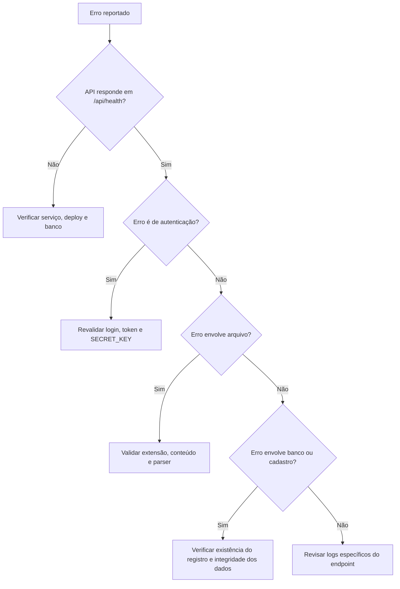

# Troubleshooting

## Objetivo

Este guia reúne sintomas recorrentes, mensagens reais do sistema e ações de diagnóstico para acelerar atendimento e recuperação.

## 1. Autenticação e sessão

### Sintoma

- login falha;
- usuário é redirecionado para a tela de login;
- frontend mostra `Sessão expirada. Faça login novamente.`

### Mensagens observadas

- `Email ou senha incorretos`
- `Não autenticado`
- `Token inválido ou expirado`
- `Usuário não encontrado`

### Verificações

- confirmar se a API responde em `/api/health`;
- confirmar se o frontend está apontando para a API correta;
- validar se `SECRET_KEY` do ambiente atual não mudou entre emissões e validações de token;
- confirmar se o usuário ainda existe e está ativo no banco;
- testar novo login para forçar emissão de token atualizado.

### Ações recomendadas

- limpar sessão local e autenticar novamente;
- revisar `FRONTEND_URL` e `VITE_API_BASE_URL` quando o problema ocorrer após deploy;
- se o problema for global após publicação, verificar rollback da configuração ou release.

## 2. Backend indisponível

### Sintoma

- tela de login informa `Servidor indisponível. Verifique a API do backend.`;
- páginas carregam sem dados;
- relatórios e cadastros falham em várias telas ao mesmo tempo.

### Verificações

- acessar `GET /api/health`;
- revisar logs do processo `uvicorn`;
- confirmar variáveis obrigatórias no ambiente;
- verificar conexão com o banco;
- em Docker Compose, revisar status dos containers.

### Ações recomendadas

- reiniciar serviço apenas depois de validar ambiente;
- em publicação com script, usar rollback se o healthcheck falhar;
- se o banco for SQLite, validar acesso ao arquivo e volume persistente.

## 3. Problemas de backup e restauração

### Mensagens observadas

- `Acesso restrito a administradores`
- `Backup/restauração disponível apenas para SQLite`
- `Arquivo do banco SQLite não identificado`
- `Arquivo de backup não encontrado`
- `Banco de dados atual não encontrado`
- `Envie um arquivo .db válido`
- `Arquivo de backup inválido (integridade SQLite falhou)`
- `Falha ao restaurar backup: ...`

### Verificações

- confirmar se o usuário logado é administrador;
- confirmar se o ambiente usa SQLite;
- validar se o arquivo enviado termina com `.db`;
- validar integridade SQLite antes da restauração;
- verificar se o caminho do banco atual existe e está acessível.

### Ações recomendadas

- gerar backup novo antes de qualquer restauração;
- não restaurar arquivo recebido de origem duvidosa sem checagem de integridade;
- conferir permissões de leitura e escrita na pasta do banco e dos backups.

## 4. Importação de extrato, OFX, CSV, REM e RET

### Sintoma

- upload rejeitado;
- nenhuma linha importada;
- muitos itens ficam pendentes após importação.

### Mensagens observadas no frontend

- `Selecione um arquivo RET, REM, CSV ou OFX`
- `Selecione um arquivo CSV, OFX, RET ou REM`
- `Erro ao importar arquivo bancário`
- `Erro ao importar extrato`

### Mensagens observadas no backend

- `Arquivo vazio`
- `Arquivo deve ser CSV, OFX, RET ou REM`

### Verificações

- confirmar extensão do arquivo;
- confirmar que o conteúdo não está vazio;
- para OFX, confirmar que o conteúdo possui estrutura reconhecível;
- para REM e RET, confirmar que o layout posicional original foi preservado;
- revisar se `codigo_dabb` dos associados está correto quando a importação envolver DABB.

### Ações recomendadas

- testar primeiro em ambiente controlado ao importar lotes grandes;
- revisar pendências de conciliação manual após importação;
- usar [docs/importacoes.md](docs/importacoes.md) como referência de formato aceito.

## 5. Importação de PDF do Banco do Brasil para DABB

### Mensagens observadas

- `Selecione um arquivo PDF do Banco do Brasil`
- `Arquivo deve ser PDF`
- `Nao foi possivel extrair texto do PDF`
- `Erro ao processar PDF do Banco do Brasil: ...`

### Verificações

- confirmar extensão `.pdf`;
- verificar se o PDF possui texto extraível;
- evitar PDF escaneado sem camada textual;
- revisar se o arquivo veio diretamente do banco;
- revisar se os códigos DABB do cadastro estão corretos.

### Ações recomendadas

- abrir o PDF e verificar se o texto pode ser selecionado;
- repetir a exportação no banco se o arquivo estiver corrompido;
- após importação, revisar se houve códigos sem membro ou ambíguos.

## 6. Importação de PDF de aplicações financeiras

### Mensagens observadas

- `Selecione um arquivo PDF válido`
- `Envie um arquivo PDF válido`
- `Leitura de PDF indisponível no servidor. Instale a dependência 'pypdf'.`
- `Não foi possível ler o PDF enviado: ...`
- `O PDF não possui texto legível. Pode ser um arquivo escaneado.`
- `Não foi possível identificar o mês/ano de referência no PDF`
- `Mês de referência não reconhecido no PDF: ...`
- `Não foi possível localizar o bloco 'Resumo do mês' no PDF`
- `Não foi possível identificar o período do extrato de CDB`
- `Período do extrato de CDB inválido`
- `Não foi possível localizar a seção 'SALDO NOS ÚLTIMOS 6 MESES'`
- `Não foi possível extrair os saldos históricos do CDB`

### Verificações

- confirmar se `pypdf` está instalado no ambiente;
- validar se o PDF corresponde ao formato esperado pelo sistema;
- confirmar que o documento não é imagem escaneada pura;
- revisar se o PDF contém bloco de resumo mensal e período identificável.

### Ações recomendadas

- usar documentos originais do banco;
- evitar PDF reimpresso por ferramenta de terceiros;
- se o layout do banco mudou, revisar o parser antes de nova importação em produção.

## 7. Erros em cadastros e plano de contas

### Mensagens observadas

- `Membro não encontrado`
- `Pagamento não encontrado`
- `Despesa não encontrada`
- `Renda não encontrada`
- `Conta não encontrada`
- `Conta inválida para entrada/saida`
- `Conta inativa`
- `Já existe uma conta com este código`
- `Conta já possui lançamentos vinculados. Inative a conta em vez de excluir.`

### Verificações

- confirmar se o registro ainda existe no banco;
- revisar se a conta está ativa e do tipo correto;
- verificar se o código de conta está duplicado;
- em casos de exclusão, confirmar vínculos existentes com lançamentos.

### Ações recomendadas

- preferir inativação de conta em vez de exclusão quando houver histórico;
- revisar dados de referência antes de importações e conciliações;
- validar parâmetros de período como `YYYY-MM` quando exigido.

## 8. Problemas de senha e usuários

### Mensagens observadas

- `A senha deve ter no mínimo 8 caracteres`
- `A senha deve conter pelo menos 1 letra maiúscula`
- `A senha deve conter pelo menos 1 letra minúscula`
- `A senha deve conter pelo menos 1 número`
- `A senha deve conter pelo menos 1 caractere especial`
- `Senha atual inválida`
- `A nova senha deve ser diferente da senha atual`
- `Email já cadastrado`
- `Você não pode remover seu próprio usuário`

### Verificações

- revisar política de senha antes de criação ou troca;
- confirmar se o e-mail já está cadastrado;
- confirmar se a alteração de senha está enviando a senha atual;
- confirmar se o usuário logado não está tentando remover a própria conta.

### Ações recomendadas

- orientar uso de senha forte com política completa;
- se houver conflito de e-mail, revisar cadastro existente antes de criar novo usuário.

## 9. Problemas em festas e envio de e-mail

### Mensagens observadas

- `Festa não encontrada`
- `Link disponível apenas para festas com data futura`
- `Configuração de e-mail incompleta no servidor`
- `Falha ao enviar e-mail: ...`
- `Informe matrícula e CPF`
- `Matrícula ou CPF inválidos`

### Verificações

- confirmar que a festa existe e ainda está válida para convite;
- validar `SMTP_HOST`, `SMTP_PORT`, `SMTP_USER`, `SMTP_PASSWORD`, `SMTP_FROM_NAME`, `SMTP_FROM_EMAIL`;
- confirmar dados do associado no fluxo público;
- testar conectividade SMTP a partir do ambiente de execução.

### Ações recomendadas

- executar envio de teste controlado após configurar SMTP;
- revisar data da festa antes de gerar convites;
- validar matrícula e CPF no cadastro quando o fluxo público falhar repetidamente.

## 10. Relatórios não geram arquivo

### Sintoma

- botão de relatório falha sem download;
- tela mostra erro de exportação em pagamentos, balancete, previsão ou aplicações.

### Verificações

- confirmar sessão autenticada;
- confirmar que a API está respondendo;
- revisar filtros informados, principalmente `mes_referencia`, `ano` e `tipo`;
- confirmar se há dados para o período;
- revisar logs do backend para exceções durante geração do Excel.

### Ações recomendadas

- testar relatório mais simples primeiro, como membros ou pagamentos;
- se o problema começou após deploy, comparar com release anterior;
- revisar dependências do backend responsáveis por Excel e PDF.

## 11. Fluxo de diagnóstico rápido

## 12. Referências úteis

- [docs/ambiente.md](docs/ambiente.md)
- [docs/api.md](docs/api.md)
- [docs/deploy-checklist.md](docs/deploy-checklist.md)
- [docs/importacoes.md](docs/importacoes.md)
- [CHANGELOG.md](CHANGELOG.md)